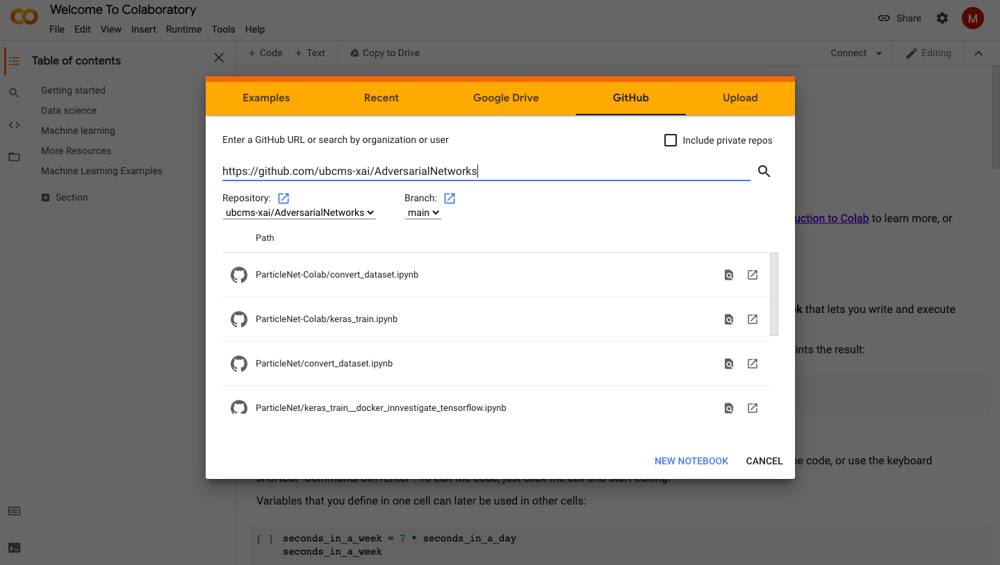

# Run Notebooks in Google Colab

Go to https://colab.research.google.com/

Select 'Github' and enter the github link. The files in this repository should appear.

1. Run convert_dataset.ipynb. This will create new directories in your google drive but you need to upload the train.h5, test.h5, and val.h5 to run the last 4 cells. You can download these files here: https://zenodo.org/record/2603256
2. Run keras_train.ipynb, which will load the converted files

